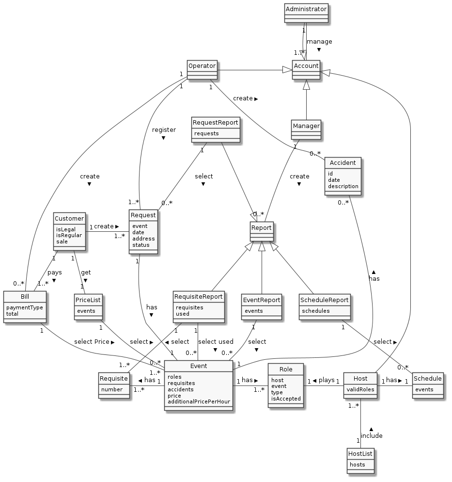
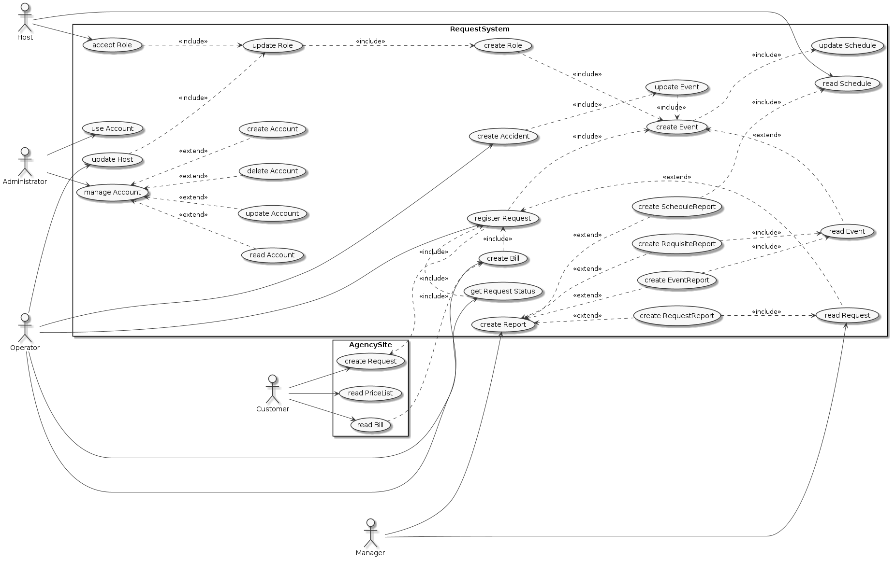

#Описание подхода к проектированию
В решении задачи "Спроектируйте основные сущности предметной области и на основании их создайте модель вариантов использования системы. Кратко поясните свой подход." было использовано два типа артефактов:
- диаграмма предметной области
- диаграмма прецедентов

В используемом подходе первой была создана диаграмма предметной области, в которой были зафиксированы основные объекты предметной области и зафиксированы их зависимости.

В создания артефакта диаграммы были выявлены следующие моменты:
- установлена зависимость между Оператором и счетом на оплату
- изменена зависимость ведущего от заявки на зависимость ведущего от роли в мероприятии

Следующей была создана диаграмма прецедентов.

В процессе создания диаграммы прецедентов устанавливается причинно-следственная связь между действиями пользователя и реакцией системы (между прецедентами). Например, изменить ведущего роли нельзя до тех пор, пока роль не была создана, но при этом создание роли зависит от создания события. В свою очередь создания события зависит от регистрации заявки заказчика. В процессе работы над созданием подобной диаграммы с выявлением зависимостей производятся корректировки диаграммы предметной области.

Форматом хранения артефактов диаграмм выбран plantuml, при каждой итерации работы над диаграммой производится фиксация изменений в системе контроля версий, чтобы можно было в дальнейшем проследить зависимость между диграммами, когда работа над одной влияет на изменения в другой диаграмме, что удается сделать, благодаря системе коммитов git.
